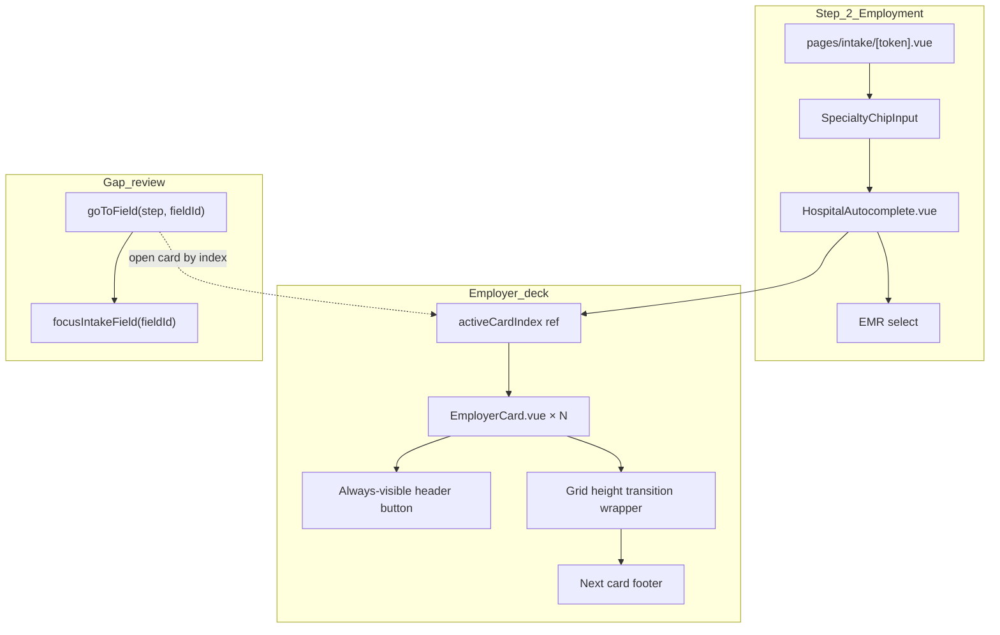

# Employer card deck (Step 2 accordion)

**Status:** Implemented — pending manual test + PR merge.

**Epic:** Part of [#16](https://github.com/juanroddotdev/resume-rocket/issues/16) (hardening sprint).

**Related:** [VMS full coverage plan](./VMS-FULL-COVERAGE-PLAN.md) (wizard length / collapsible employer cards), [mobile-first intake](../.cursor/rules/mobile-first-intake.mdc), [MANUAL-TEST-CHECKLIST.md](./MANUAL-TEST-CHECKLIST.md) §D Step 2.

**Scope:** Intake wizard Step 2 — Employment mapping UI only. No parse, DOCX, or schema changes.

---

## Problem

Step 2 renders every employer as a fully expanded card in a vertical list ([`HospitalAutocomplete.vue`](../components/intake/HospitalAutocomplete.vue) → [`EmployerCard.vue`](../components/intake/EmployerCard.vue)). Each card has 15+ fields plus optional clinical detail.

Parse-heavy resumes can produce **8–12 employers**. On mobile (`max-w-md`), candidates scroll through repeated chrome and lose context about which job they are editing.

**Note:** Step 2 lives in [`pages/intake/[token].vue`](../pages/intake/[token].vue), not [`pages/index.vue`](../pages/index.vue) (landing page only).

---

## Goals

| Today | Target |
|-------|--------|
| All employer forms expanded at once | **Stacked card deck** — headers always visible, one card open at a time |
| Long vertical scroll on mobile | Focused editing: hospital name, role, dates visible in every header |
| No in-step employer navigation | **Next card** action inside expanded card footer |
| Gap review deep-links may focus hidden fields | Opening the correct card before `focusIntakeField` |

**Non-goals (this PR):**

- Education repeater accordion (Step 3) — same pattern could follow later
- New validation rules or gap-review field requirements
- Persisting `activeCardIndex` in localStorage / PATCH payload

---

## Architecture



### State ownership

| State | Owner | Notes |
|-------|-------|-------|
| `employers[]` | `useCandidateForm` (unchanged) | Autosave via PATCH |
| `activeCardIndex` | `HospitalAutocomplete.vue` | Local UI state; clamp on list mutations |
| `showClinical`, `showLinkSearch` | `EmployerCard.vue` (unchanged) | Per-card nested toggles |

### Component split

Refactor [`EmployerCard.vue`](../components/intake/EmployerCard.vue) into two visual regions:

1. **Header** (permanent) — `<button type="button">` showing hospital name, role, date range; move up/down and remove stay here.
2. **Body** (animated) — existing form grid + footer with **Next card**.

New props / events on `EmployerCard`:

```ts
defineProps<{
  expanded: boolean
  // …existing employer, index, canMoveUp, canMoveDown
}>()

defineEmits<{
  toggle: []
  'next-card': []
  // …existing update, remove, move-up, move-down
}>()
```

Orchestration in `HospitalAutocomplete.vue`:

```ts
const activeCardIndex = ref(0)

function openCard(index: number) {
  activeCardIndex.value = index
}

function goToNextCard(fromIndex: number) {
  const next = Math.min(fromIndex + 1, props.employers.length - 1)
  activeCardIndex.value = next
  // after nextTick: scroll new header into view
}
```

---

## Stacked deck UX

### Header summary (always visible)

Display on every collapsed and expanded card:

- **Hospital name** — `employer.name` (primary line)
- **Role** — `employer.role` or placeholder `Role not set`
- **Dates** — `{startDate} – {endDate || 'Present'}` or `Dates not set`

Optional polish:

- Active card: `border-l-4 border-brand-600`
- Stack overlap on collapsed cards: `-mt-2` (except first), `relative z-10`, light shadow
- Incomplete indicator: amber dot when gap-review fields for that index are empty (optional, non-blocking)

### Single-open accordion

- Tapping a header sets `activeCardIndex = index` (closes any other open card).
- Tapping the **already open** header: keep expanded (recommended — avoids accidental collapse while editing).

### Next card footer

Inside the expanded body, after all fields:

| Condition | Button |
|-----------|--------|
| Not last employer | `Next card →` — advances to `index + 1`, scrolls header into view |
| Last employer | Hide button or show muted `All employers listed` |

Step-level **Back / Next** in [`pages/intake/[token].vue`](../pages/intake/[token].vue) unchanged; still gated by `canAdvanceStep2()` (`employers.length > 0`).

### Layout order (unchanged)

1. Facility search (add employers)
2. Employer card deck
3. EMR platform select

---

## Height transition (Tailwind)

Avoid `max-height` transitions — card height varies (link search, suggestions, optional clinical block).

Use CSS grid row animation:

```html
<div
  class="grid transition-[grid-template-rows] duration-300 ease-out motion-reduce:transition-none"
  :class="expanded ? 'grid-rows-[1fr]' : 'grid-rows-[0fr]'"
>
  <div class="min-h-0 overflow-hidden">
    <!-- form fields + footer -->
  </div>
</div>
```

- Header sits **outside** the grid wrapper.
- Nested `showClinical` / `showLinkSearch` resize the open card naturally while expanded.

---

## `activeCardIndex` lifecycle

| Event | Behavior |
|-------|----------|
| First employer added | `activeCardIndex = 0` |
| Add employer | Expand new last index |
| Remove employer | `activeCardIndex = clamp(index, 0, length - 1)` |
| Move up / down | If moved card was active, follow to new index |
| Employers list empty | Index irrelevant; empty state unchanged |
| Header tap | `activeCardIndex = index` |
| Next card | `min(index + 1, length - 1)` + scroll header |

```ts
watch(() => props.employers.length, (len, prevLen) => {
  if (len > prevLen) activeCardIndex.value = len - 1
  else if (activeCardIndex.value >= len) {
    activeCardIndex.value = Math.max(0, len - 1)
  }
})
```

When reordering, update index if the active card moved:

```ts
function moveEmployer(index: number, direction: -1 | 1) {
  // …existing splice logic
  if (activeCardIndex.value === index) {
    activeCardIndex.value = index + direction
  } else if (activeCardIndex.value === index + direction) {
    activeCardIndex.value = index
  }
}
```

---

## Gap review integration (required)

Review step calls `goToField(step, fieldId)` → `focusIntakeField(fieldId)` ([`pages/intake/[token].vue`](../pages/intake/[token].vue), [`utils/focusIntakeField.ts`](../utils/focusIntakeField.ts)).

Employer field IDs follow `employer-{index}-{field}` (e.g. `employer-2-role`). Collapsed cards hide inputs — focus will fail unless the deck opens first.

**Option A (recommended):** Parse index from `fieldId` in `HospitalAutocomplete` via watcher or exposed method:

```ts
// employer-2-role → index 2
const match = fieldId.match(/^employer-(\d+)-/)
if (match) activeCardIndex.value = Number(match[1])
```

**Option B:** `defineExpose({ openEmployerCard })` on `HospitalAutocomplete`; parent holds a ref and calls it from `goToField` before focus.

Also handle nested UI:

- `employer-{i}-link` → expand card `i` and set `showLinkSearch = true` on that card (prop or exposed method).

Ensure `await nextTick()` (×2 if step changed) before `focusIntakeField` — already done in `goToField`.

---

## Accessibility

- Header is a `<button>`, not a clickable `<div>`.
- `aria-expanded="{expanded}"` on header.
- `aria-controls="employer-panel-{index}"` on header; matching `id` on body panel.
- `motion-reduce:transition-none` on animated wrapper.
- Move/remove buttons: keep existing `aria-label`s; stop propagation on header click if needed.

---

## Implementation checklist

### `HospitalAutocomplete.vue`

- [x] Add `activeCardIndex` ref + lifecycle watchers
- [x] Replace `space-y-3` list with deck container (`employer-deck` class if needed)
- [x] Pass `:expanded="activeCardIndex === index"` and wire `@toggle` / `@next-card`
- [x] Update `moveEmployer` to keep `activeCardIndex` in sync
- [x] Expose `openEmployerField(fieldId)` for gap review
- [x] On add employer: expand new card

### `EmployerCard.vue`

- [x] Split template: header button + animated body wrapper
- [x] Move summary (name, role, dates) into header; demote or remove duplicate title block in body
- [x] Add `expanded` prop; emit `toggle` on header click
- [x] Add footer with **Next card** (hidden on last index via `isLast` prop)
- [x] Keep all `intake-field-employer-{index}-*` IDs unchanged (gap review contract)

### `pages/intake/[token].vue`

- [x] Ref on `HospitalAutocomplete`; call `openEmployerField` from `goToField` when `fieldId` matches `employer-*`

### `assets/css/main.css`

- [x] `.employer-deck` container class (stack overlap via card `-mt-2` in component)

### Docs / tracking

- [x] Link from [TODO.md](./TODO.md) Step 2 employer cards section (priority order + Related plans header)
- [x] Update [MANUAL-TEST-CHECKLIST.md](./MANUAL-TEST-CHECKLIST.md) Step 2 with deck behaviors

---

## Test plan

### Manual ([MANUAL-TEST-CHECKLIST.md](./MANUAL-TEST-CHECKLIST.md) §D)

- [ ] Parse resume with 3+ employers → Step 2 shows stacked headers; only first (or last added) expanded
- [ ] Tap header → previous card collapses, target expands with smooth animation
- [ ] **Next card** → advances to next employer; header scrolls into view on mobile viewport
- [ ] Add employer via search → new card expands
- [ ] Remove active employer → index clamps; no crash with one employer left
- [ ] Reorder ↑ / ↓ → active card follows when moved
- [ ] EMR + specialties still work; autosave chip unchanged
- [ ] Step 2 **Next** still requires `employers.length > 0`
- [ ] Review → tap “Employer 2: role / unit” → Step 2 opens card 2 and focuses role input
- [ ] Review → tap “Employer 1: link facility” → card opens with link search visible
- [ ] `prefers-reduced-motion`: expansion is instant (no animation jank)

### Regression

- [ ] `node scripts/test-docx-mapping.mjs` — employer order and fields unchanged
- [ ] `npm run build` compiles

---

## Suggested PR

**Title:** `Step 2: stacked employer card deck accordion`

**Files:** `HospitalAutocomplete.vue`, `EmployerCard.vue`, optionally `pages/intake/[token].vue`, `docs/MANUAL-TEST-CHECKLIST.md`

**Issue:** `Part of #16` — UX hardening; no child issue required unless you open one for tracking.

**Size:** One concern per PR; avoid bundling with MetricTile or education repeater work in [TODO.md](./TODO.md).
