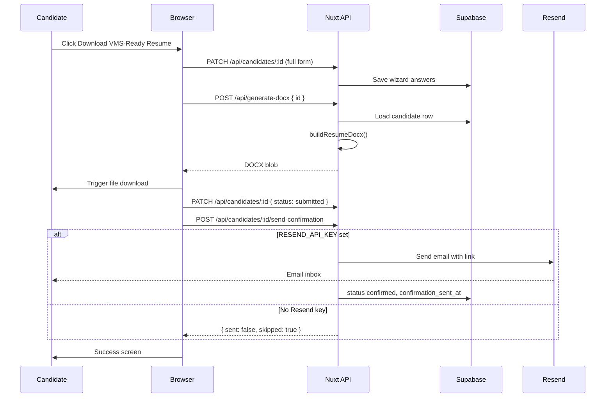

# Intake download & confirmation email flow

How Resume Rocket delivers the VMS-ready DOCX to candidates and optionally sends a confirmation email via Resend.

**Related code:** [`composables/useCandidateForm.ts`](../composables/useCandidateForm.ts) · [`server/api/generate-docx.post.ts`](../server/api/generate-docx.post.ts) · [`server/api/candidates/[id]/send-confirmation.post.ts`](../server/api/candidates/[id]/send-confirmation.post.ts) · [`pages/intake/[token].vue`](../pages/intake/[token].vue) · [`pages/intake/complete/[accessToken].vue`](../pages/intake/complete/[accessToken].vue)

---

## Overview

There are **two ways** a candidate can get the DOCX:

1. **Immediate browser download** — when they click **Download VMS-Ready Resume** on Step 4 (review).
2. **Email link download** — optional follow-up via Resend, if configured.

Recruiters download the same file from the **admin hub** using a separate auth path (admin JWT, not intake invite token).

---

## Submit flow (Step 4 → success)

On review, clicking submit runs `goSuccess()` → `finalizeAndDownload()` in `useCandidateForm.ts`. Steps run **in order**:

| Step | Action | Notes |
|------|--------|-------|
| 1 | `PATCH /api/candidates/:id` | Saves full wizard form |
| 2 | `POST /api/generate-docx` `{ id }` | Builds DOCX; browser triggers download |
| 3 | `PATCH /api/candidates/:id` `{ status: 'submitted' }` | Marks submission |
| 4 | `POST /api/candidates/:id/send-confirmation` | Optional email; failure does not block success |

---

## DOCX generation

`POST /api/generate-docx` loads the candidate row, runs `buildResumeDocx()` (`server/utils/docxBuilder.ts`), and returns a Word file.

**Auth depends on request body:**

| Caller | Body | Auth |
|--------|------|------|
| Intake wizard / Download again | `{ id: candidateId }` | Invite token (`x-intake-token` header or httpOnly cookie) |
| Email link page | `{ access_token: "..." }` | Token must match `candidates.access_token` |
| Admin hub | `{ id }` | Supabase admin JWT (`Authorization: Bearer …`) |

Filename pattern: `resume-{last_name}.docx`.

---

## Confirmation email (optional)

Handled by `POST /api/candidates/:id/send-confirmation`.

Email sends only when **all** of the following are true:

- `RESEND_API_KEY` is set (otherwise `sendEmail.ts` returns `{ skipped: true }`)
- Candidate has an email on file
- Status is already `submitted` (set in step 3 above)

When it sends:

1. Creates or reuses `access_token` on the candidate row (random hex).
2. Sends email via Resend with link: `{NUXT_PUBLIC_SITE_URL}/intake/complete/{accessToken}`.
3. Sets `status: 'confirmed'` and `confirmation_sent_at`.

Email is a **receipt + backup download link**, not the only delivery path.

---

## Success screen (candidate UI)

After submit, the candidate always sees:

> Your VMS-ready placement packet (DOCX) was downloaded. Your recruiter receives the same file for hospital submission.

If email sent (`{ sent: true }`):

> Check your inbox at **{email}** for a confirmation link.

**Download again** calls `downloadDocxOnly()` — regenerates and downloads the DOCX only. Does not re-submit or send another email.

---

## Email link landing page

Route: `/intake/complete/[accessToken]`

Simple page with a **Download DOCX** button. Calls `POST /api/generate-docx` with `{ access_token }` — no intake invite required.

---

## Graceful degradation

| Condition | Behavior |
|-----------|----------|
| `RESEND_API_KEY` missing | Skip email; log server-side; intake completes |
| Email send fails | Return `{ sent: false }`; user still reaches success |
| DOCX generation fails | User stays on review with error + retry; status not set to submitted |
| Submit PATCH fails after download | Error: “Download succeeded but submission could not be finalized” |

Core path (intake → DOCX download) must not depend on Resend.

---

## Env vars

See `.env.example`:

- `RESEND_API_KEY` — server-only; required for email
- `RESEND_FROM_EMAIL` — sender address
- `NUXT_PUBLIC_SITE_URL` — base URL for links in confirmation email
