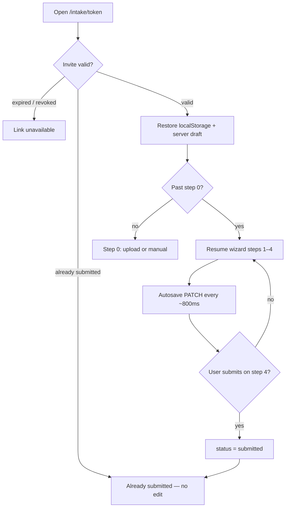

# Intake draft & resume flow

How candidates start, pause, and resume the intake wizard before final submit — and when the invite link stops allowing edits.

**Related code:** [`pages/intake/[token].vue`](../pages/intake/[token].vue) · [`composables/useCandidateForm.ts`](../composables/useCandidateForm.ts) · [`composables/useIntakeInvite.ts`](../composables/useIntakeInvite.ts) · [`composables/useIntakeWizardNav.ts`](../composables/useIntakeWizardNav.ts) · [`server/utils/requireInvite.ts`](../server/utils/requireInvite.ts) · [`server/api/candidates.post.ts`](../server/api/candidates.post.ts) · [`server/api/candidates/[id].get.ts`](../server/api/candidates/[id].get.ts) · [`server/api/candidates/[id].patch.ts`](../server/api/candidates/[id].patch.ts)

**See also:** [INTAKE-DOWNLOAD-EMAIL-FLOW.md](./INTAKE-DOWNLOAD-EMAIL-FLOW.md) (submit, DOCX download, confirmation email)

---

## Short answer

**Yes — until they finish submit.** If a candidate stops partway through, closes the tab, and opens the **same invite link** again, they can usually pick up where they left off. After they submit on Step 4 (download), that link stops working for editing and shows “already submitted.”

---

## Wizard overview

| Step | What happens |
|------|----------------|
| **0** | Upload resume or **Continue manually** — creates or resumes a `candidates` row with `status: 'draft'` |
| **1** | Identity (name, email, phone, license basics) |
| **2** | Employers + EMR |
| **3** | Credentials + education |
| **4** | Review → **Download VMS-Ready Resume** (final submit) |

Recruiters create links from `/admin` → **+ New candidate** → **Create & copy link** (or upload / start from scratch). Default link lifetime: **7 days** (`expires_at` on `intake_invites`).

### Admin builder (concierge workflow)

Recruiters can complete the same packet in [`/admin`](../pages/admin.vue) without opening the invite URL:

1. **Create link & start packet** — **Send intake link** (copy URL, stay on candidates table) or upload / scratch (opens builder); all create invite + draft row
2. **Upload / parse / edit** — section-based desktop UI; autosave via `PATCH /api/admin/candidates/:id`
3. **Download draft DOCX** — does not change `status` (candidate link stays editable)
4. **Copy invite link** — from the create success screen, or **Copy link** / **Open intake** in the candidates table
5. **Mark submitted** — downloads DOCX, sets `status: submitted`, locks the invite (same as candidate final submit)

Same `candidates` row and invite token — handoff mid-draft works as in [Returning to the same link](#returning-to-the-same-link).

---

## What gets saved while they work

The app uses **two layers** of persistence:

| Layer | What it stores | When |
|-------|----------------|------|
| **Server (Supabase)** | Full draft in a `candidates` row (`status: 'draft'`) | After upload or “Continue manually” creates the row; then autosave `PATCH`es every **~800ms** while they edit steps 1–4 |
| **Browser (`localStorage`)** | Form fields, current step, `candidateId`, parse metadata | Key: `resume-rocket-draft:{token}` — updated after successful server save and on step navigation |

Invite validation also sets an httpOnly `intake_token` cookie (7-day `maxAge`) so API calls work without the client always sending a header.

---

## Returning to the same link

On page load, `bootstrapInvite()` in [`pages/intake/[token].vue`](../pages/intake/[token].vue):

1. Validates the invite (`GET /api/invites/validate`)
2. Restores from `localStorage` (same browser)
3. Binds `candidate_id` from the invite if present
4. Hydrates from server when status is still `draft` (`GET /api/candidates/:id`)
5. Merges local vs server — **newer timestamp wins** (`updated_at` vs local `savedAt`)
6. Resolves wizard step from URL `?step=` or saved local step
7. Shows **“Draft restored — You can pick up where you left off”** on steps 1–4 when data was restored

### They can continue editing when

- The link is still valid (not expired or revoked)
- They have **not** submitted yet (`status` is still `draft`)
- They got past step 0 at least once (upload or manual continue), so a candidate row exists

### Same browser vs different device

| Scenario | Behavior |
|----------|----------|
| **Same browser** | Best experience — step and form from `localStorage` plus server merge |
| **Different browser / device** | Server draft loads via invite’s linked `candidate_id`; answers restore, step may default differently without local storage |
| **Opened link only, never passed step 0** | No server row yet — little to restore; starts fresh at step 0 |

---

## When they cannot continue editing

After **Download VMS-Ready Resume** on Step 4 (`finalizeAndDownload()`):

1. Full form is saved (`PATCH`)
2. DOCX is generated and downloaded
3. Status becomes `submitted` (`PATCH { status: 'submitted' }`)
4. `intake_invites.used_at` is set
5. `localStorage` draft for that token is cleared

Reopening the invite link then fails validation with reason `completed`. The UI shows:

> **Link unavailable** — This application was already submitted.

`validateInviteToken()` blocks invites whose linked candidate has `status` of `submitted` or `confirmed`. `PATCH` on an already-submitted row also returns **409** unless the body is only finalizing `status: 'submitted'`.

### After submit — download only

Candidates can still get the DOCX again, but not edit via the invite:

- **Success screen** — **Download again** (`downloadDocxOnly()`; same session)
- **Confirmation email** — `/intake/complete/{accessToken}` (see [INTAKE-DOWNLOAD-EMAIL-FLOW.md](./INTAKE-DOWNLOAD-EMAIL-FLOW.md))

Neither path reopens the editable wizard.

---

## Autosave & navigation behavior

- **Debounced autosave:** 800ms after field changes on steps 1–4 (`scheduleAutosave` → `PATCH /api/candidates/:id`)
- **Step changes:** `flushAutosave()` runs before navigating; step is persisted to `localStorage` and URL `?step=`
- **Back navigation:** Moving between steps does **not** wipe the draft
- **Save chip:** “Saving…” / “Saved” on editable steps (and step 0 once `candidateId` exists)
- **Save errors:** “Save failed — Retry” with retry action

---

## Edge cases & limits

| Situation | Behavior |
|-----------|----------|
| **Link expired** (~7 days) | “This link has expired.” — draft may still exist in DB but link cannot be used |
| **Link revoked** | “Ask your recruiter for a new intake link.” |
| **Close tab mid-typing** | Last ~800ms of edits may not reach server or `localStorage` if autosave had not fired |
| **Success step in URL** | After submit, invite validation fails before wizard loads |
| **Admin recruiter preview** | Admin view can download a draft packet without changing candidate status — separate from real client submit |

---

## Invite ↔ candidate binding

- First upload or `POST /api/candidates` creates a draft row and sets `intake_invites.candidate_id`
- Subsequent opens of the same invite reuse that candidate (`resumed: true` from `candidates.post.ts`)
- One invite maps to one candidate draft until submit

---

## Manual test checklist

- [ ] Start intake → fill step 1 → close tab → reopen same link → fields and step restored; “Draft restored” banner
- [ ] Repeat on a second browser (or incognito) after passing step 0 → server answers load
- [ ] Open link, never upload / manual → still at step 0
- [ ] Complete submit → reopen invite → “already submitted”
- [ ] After submit → **Download again** on success screen still works
- [ ] Expired invite (or past `expires_at` in DB) → expired message

See also [MANUAL-TEST-CHECKLIST.md](./MANUAL-TEST-CHECKLIST.md) for full intake regression items.
