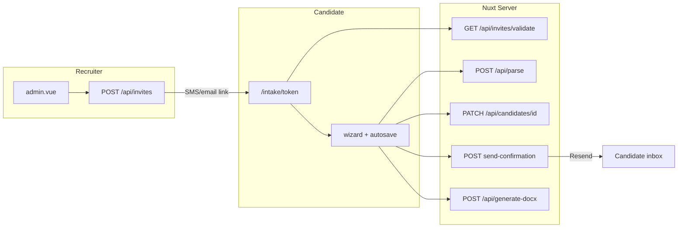

# Resume Rocket Platform — MVP Initialization Plan

## Assessment of your prompt

Your blueprint is **strong and implementable**. It clearly separates concerns (parse → enrich → assemble), picks appropriate tools for each layer, and defines an end-to-end mobile intake flow plus recruiter admin surface. A few **gaps to close in implementation** (not flaws in your spec):

| Area | Your spec | Recommended addition |
|------|-----------|----------------------|
| Candidate persistence | `candidates` table defined | **Confirmed:** draft on parse complete; `PATCH` autosave each step; finalize on Success. |
| Temp file storage | Supabase Storage mentioned | **Confirmed:** `resumes` bucket; store original PDF/DOCX path on candidate row. |
| Uploader UX | Multi-step wizard | **Confirmed:** back nav, parse-failure manual path, re-upload, privacy line, saved indicator. |
| Admin auth | “Protected via Supabase” | Use `@nuxtjs/supabase` middleware on [`pages/admin.vue`](pages/admin.vue) + RLS: recruiters read all candidates; anon cannot. |
| `template.docx` | Asset at `/server/assets/template.docx` | Ship a **minimal placeholder** `.docx` with tags matching docxtemplater keys; you replace with contract template later. |
| Parse libraries | PDF/DOCX upload | Use `pdf-parse` (PDF) + `mammoth` (DOCX); reject other MIME types with 415. |
| Gemini | Structured JSON | `@google/generative-ai` with `responseSchema` / JSON mode for `{ first_name, last_name, email, phone, suggested_employers[] }`. |

| Candidate access | Public intake | **Confirmed hybrid:** admin invite link gates entry; confirmation email on complete. |
| Email | Not specified | **Confirmed:** Resend (or SMTP) transactional email with receipt + resume link. |

**Post-MVP (defer):** rate-limit `/api/parse`, virus-scan, camera capture, duplicate detection, candidate Supabase Auth accounts, recruiter notes.

---

## Assumptions (change before execute if needed)

- **Project path:** `~/resume-rocket` (created via `create_project` MCP, then `move_agent_to_root`).
- **Supabase:** SQL migrations + [`.env.example`](.env.example) only; you paste `SUPABASE_URL`, `SUPABASE_KEY`, and `SUPABASE_SERVICE_KEY` (server-only) after linking a project.
- **Secrets:** `GEMINI_API_KEY` in server runtime only (never `NUXT_PUBLIC_*`).

---

## Architecture



---

## Phase 1 — Scaffold Nuxt 3 project

1. Run `npx nuxi@latest init resume-rocket` (or equivalent) at `~/resume-rocket`.
2. Install and configure:
   - `@nuxtjs/tailwindcss`
   - `@nuxtjs/supabase` (SSR module, redirect options for admin)
   - Runtime deps: `@google/generative-ai`, `pdf-parse`, `mammoth`, `pizzip`, `docxtemplater`, `zod` (validation)
3. Configure [`nuxt.config.ts`](nuxt.config.ts):
   - `runtimeConfig`: `geminiApiKey`, `supabaseServiceKey` (private)
   - `modules`: `['@nuxtjs/tailwindcss', '@nuxtjs/supabase']`
   - `supabase.redirectOptions`: login redirect for `/admin` only
4. Add [`app.vue`](app.vue) with mobile-first base font/viewport; optional [`layouts/default.vue`](layouts/default.vue) for admin chrome.

**Directory layout (target):**

```
resume-rocket/
├── app.vue
├── nuxt.config.ts
├── tailwind.config.ts
├── .env.example
├── types/
│   ├── candidate.ts
│   ├── hospital.ts
│   └── parse.ts
├── composables/
│   └── useCandidateForm.ts
├── components/
│   ├── intake/
│   │   ├── FileDropZone.vue
│   │   ├── HospitalAutocomplete.vue
│   │   └── CredentialsChecklist.vue
│   └── admin/
│       └── CandidatesTable.vue
├── pages/
│   ├── index.vue              # landing: "Use your recruiter link"
│   ├── intake/
│   │   ├── [token].vue        # gated wizard
│   │   └── complete/
│   │       └── [accessToken].vue  # email link: re-download docx only
│   └── admin.vue
├── middleware/
│   ├── auth.ts                # admin only
│   └── intake-invite.ts       # validates route token
├── server/
│   ├── api/
│   │   ├── parse.post.ts
│   │   ├── generate-docx.post.ts
│   │   ├── invites.post.ts
│   │   ├── invites/
│   │   │   └── validate.get.ts
│   │   ├── candidates.post.ts
│   │   ├── candidates/
│   │   │   ├── [id].patch.ts
│   │   │   └── [id]/
│   │   │       └── send-confirmation.post.ts
│   │   └── hospitals/
│   │       └── search.get.ts
│   ├── utils/
│   │   ├── supabase.ts          # service-role client
│   │   ├── extractText.ts
│   │   ├── geminiParse.ts
│   │   ├── storageUpload.ts
│   │   ├── requireInvite.ts
│   │   ├── sendEmail.ts
│   │   └── docxBuilder.ts
│   └── assets/
│       └── template.docx
└── supabase/
    └── migrations/
        └── 20260520000000_init_schema.sql
```

---

## Phase 2 — Supabase schema & RLS

Single migration [`supabase/migrations/20260520000000_init_schema.sql`](supabase/migrations/20260520000000_init_schema.sql):

**Extensions & hospitals**

```sql
CREATE EXTENSION IF NOT EXISTS pg_trgm;

CREATE TABLE hospitals (
  id UUID PRIMARY KEY DEFAULT gen_random_uuid(),
  name TEXT NOT NULL,
  beds INT,
  trauma_level TEXT,
  teaching_status BOOLEAN DEFAULT false
);

CREATE INDEX hospitals_name_trgm_idx ON hospitals USING gin (name gin_trgm_ops);
```

**Candidates**

```sql
CREATE TYPE candidate_status AS ENUM ('draft', 'completed');

CREATE TABLE candidates (
  id UUID PRIMARY KEY DEFAULT gen_random_uuid(),
  created_at TIMESTAMPTZ NOT NULL DEFAULT now(),
  updated_at TIMESTAMPTZ NOT NULL DEFAULT now(),
  status candidate_status NOT NULL DEFAULT 'draft',
  first_name TEXT,
  last_name TEXT,
  email TEXT,
  phone TEXT,
  license_number TEXT,
  certifications JSONB DEFAULT '[]'::jsonb,
  emr_system TEXT,
  facility_history JSONB DEFAULT '[]'::jsonb,
  resume_storage_path TEXT,
  resume_original_filename TEXT,
  parse_error TEXT,
  invite_id UUID REFERENCES intake_invites(id),
  access_token TEXT UNIQUE,
  confirmation_sent_at TIMESTAMPTZ
);

CREATE TABLE intake_invites (
  id UUID PRIMARY KEY DEFAULT gen_random_uuid(),
  token TEXT UNIQUE NOT NULL,
  created_by UUID REFERENCES auth.users(id),
  candidate_email TEXT,
  candidate_id UUID REFERENCES candidates(id),
  expires_at TIMESTAMPTZ NOT NULL,
  revoked_at TIMESTAMPTZ,
  created_at TIMESTAMPTZ NOT NULL DEFAULT now()
);

CREATE TRIGGER candidates_updated_at
  BEFORE UPDATE ON candidates
  FOR EACH ROW EXECUTE FUNCTION moddatetime(updated_at);
```

**Storage bucket `resumes`**

- Private bucket; objects at `{candidate_id}/{uuid}-{filename}`.
- Upload via **service role** in `POST /api/parse` after draft row exists (or create draft first, then upload).
- Store `resume_storage_path` on candidate; admin can open signed URL (server-generated, short TTL) in a later polish — MVP: path visible in admin only if needed.

**RLS (MVP-safe defaults)**

- Enable RLS on both tables + Storage policies aligned with server-only writes.
- `hospitals`: `SELECT` for `anon` + `authenticated`.
- `candidates`: all **INSERT/UPDATE** via Nuxt service role; `SELECT` for `authenticated` recruiters; no direct anon client writes.
- `intake_invites`: `INSERT/SELECT/UPDATE` via service role; recruiters create via authenticated admin API only.

**Search query** in [`server/api/hospitals/search.get.ts`](server/api/hospitals/search.get.ts):

```sql
SELECT *, similarity(name, $query) AS score
FROM hospitals
WHERE name % $query OR name ILIKE '%' || $query || '%'
ORDER BY score DESC NULLS LAST
LIMIT 10;
```

Optional seed migration with ~20 sample hospitals for demo trigram matches.

---

## Candidate access: hybrid invite + confirmation (confirmed)

**Recommendation (why not full candidate login):** Nurses are one-time users; Supabase Auth signup adds friction and support burden. **Admin-issued invite links** match recruiter-driven staffing workflows and actually restrict who can start intake. **Email on completion** gives proof-of-submission without blocking upload.

### 1) Admin-shared invite link (gate)

- Recruiter in `/admin` clicks **Create intake link** → optional pre-fill email → `POST /api/invites` (authenticated).
- Server generates `token` (`crypto.randomBytes(32)` hex), `expires_at` default **7 days**, stores `created_by`.
- Returns copyable URL: `{APP_URL}/intake/{token}` (recruiter sends via SMS/email/ATS).
- [`pages/intake/[token].vue`](pages/intake/[token].vue) calls `GET /api/invites/validate?token=` on mount:
  - Invalid/expired/revoked → friendly “Ask your recruiter for a new link.”
  - Valid → bind `invite_id`; create or resume linked `candidates` draft; store token in composable + `httpOnly` cookie `intake_token` for API calls.
- **All intake server routes** call [`server/utils/requireInvite.ts`](server/utils/requireInvite.ts): token must match `candidate.invite_id` and invite not expired.
- [`pages/index.vue`](pages/index.vue): public landing only — no wizard without token.

**Reuse rules:** Same invite can resume a `draft` until `completed`; after completion, invite returns “already submitted” (optional one-time completion).

### 2) Completion confirmation email

- Triggered on Success after `status: completed` (server-side, not fire-and-forget client-only).
- `POST /api/candidates/[id]/send-confirmation` (internal or called from finalize handler):
  - Requires `email` on candidate row.
  - Generates `access_token` on candidate if missing (for email deep link).
  - Sends via **Resend** ([`server/utils/sendEmail.ts`](server/utils/sendEmail.ts)):
    - Subject: “Your Resume Rocket submission is complete”
    - Body: submitted timestamp, recruiter contact placeholder, link `{APP_URL}/intake/complete/{access_token}` to re-download VMS docx (read-only; no edit after complete).
  - Sets `confirmation_sent_at`; UI shows “Confirmation sent to {email}” even if send fails (log error, show retry).

### 3) What we are NOT building

- Candidate passwords / Supabase Auth accounts for nurses.
- Public open intake at `/` (by design).
- Email OTP at step 0 (invite already identifies the session; email collected in Step 1 for confirmation).

---

## Phase 3 — Shared types & composable

[`types/candidate.ts`](types/candidate.ts): `CandidateForm`, `FacilityHistoryEntry`, `CertificationKey` union (`BLS`, `ACLS`, `PALS`, …).

[`composables/useCandidateForm.ts`](composables/useCandidateForm.ts):

- Central `candidateForm` ref + `candidateId` ref + `status: 'draft' | 'completed'`
- `currentStep` (0–3 + `'success'`)
- **`autosave`**: debounced 800ms `PATCH /api/candidates/:id` after steps 1–3 field changes; subtle “Saved” / “Saving…” chip
- **`localStorage`**: key `resume-rocket-draft` mirrors `{ candidateId, step, form }` — restore on refresh if draft still exists server-side
- [`composables/useIntakeInvite.ts`](composables/useIntakeInvite.ts): `inviteToken`, `inviteValid`, `inviteEmail`
- Helpers: `applyParseResult`, `createDraft`, `addEmployer`, `replaceResume`, `finalize`, `reset`

---

## What resume uploaders expect (in MVP)

| Expectation | MVP implementation |
|-------------|-------------------|
| Don’t lose my work | Server draft + per-step PATCH + localStorage backup |
| Know supported formats | Step 0 copy: “PDF or Word (.docx), max 10MB” |
| See progress | Spinner + stage label (“Reading file…”, “Extracting fields…”) |
| Fix bad parsing | If parse fails: inline error + **Continue manually** (skip to Step 1 empty) |
| Change my file | “Replace resume” on Step 1 re-opens drop zone; re-parse updates draft |
| Go back a step | Back button on steps 1–3 (does not wipe saved draft) |
| Trust / privacy | One-line HIPAA-oriented notice on Step 0 (data used for placement only; not sold) |
| Confirmation | Success screen + **email receipt** to address entered in Step 1 |
| Access | Only via **recruiter invite link** (not a public form) |
| Required fields clear | Native validation + red inline hints before advance |

**Post-MVP:** camera scan, duplicate detection, virus scan, rate limits, candidate self-serve login.

---

## Intake persistence flow (draft → completed)

1. **Invite validated** → `POST /api/candidates` with `invite_id` creates `status: draft`.
2. **After parse** (or manual continue): upload to Storage; link `resume_storage_path`.
3. **Steps 1–3**: debounced `PATCH` (requires invite token).
4. **Success**: `PATCH status=completed` → `generate-docx` download → `send-confirmation` email.

Admin grid shows **Status** (`draft` / `completed`) so recruiters see abandoned intakes.

---

## Phase 4 — Server API routes

### `POST /api/parse` — [`server/api/parse.post.ts`](server/api/parse.post.ts)

1. Read multipart; validate MIME (PDF/DOCX) + max 10MB; human-readable 415/413 errors.
2. Optional body `candidateId` — if re-upload, update existing draft; else create draft row first.
3. [`server/utils/storageUpload.ts`](server/utils/storageUpload.ts): upload buffer to `resumes/{candidateId}/...`.
4. Extract text → Gemini structured parse.
5. On Gemini failure: still return `{ candidateId, parse_failed: true }` and persist `parse_error` on row; client offers manual entry.
6. On success: `PATCH` draft with parsed fields + return `{ candidateId, ...ParseResult }`.

### `GET /api/hospitals/search` — [`server/api/hospitals/search.get.ts`](server/api/hospitals/search.get.ts)

- Query param `query` (min 2 chars).
- Service-role Supabase RPC or raw SQL with `%` trigram operator.
- Return `{ hospitals: Hospital[] }`.

### `POST /api/invites` — [`server/api/invites.post.ts`](server/api/invites.post.ts)

- **Admin auth required** (`requireAdminSession`).
- Body: optional `candidate_email`, `expires_in_days` (default 7).
- Returns `{ token, url, expires_at }`.

### `GET /api/invites/validate` — [`server/api/invites/validate.get.ts`](server/api/invites/validate.get.ts)

- Query `token`; returns `{ valid, candidate_id?, candidate_email?, expired }`.
- Sets httpOnly cookie when valid.

### `POST /api/candidates` — [`server/api/candidates.post.ts`](server/api/candidates.post.ts)

- Requires valid invite token; creates `draft` linked to `invite_id`.
- Returns `{ id, status, created_at }`; updates `intake_invites.candidate_id`.

### `PATCH /api/candidates/[id]` — [`server/api/candidates/[id].patch.ts`](server/api/candidates/[id].patch.ts)

- Partial Zod body; updates `updated_at`.
- Accepts `status: 'completed'` on finalize.
- Rejects updates to already-`completed` rows (409).
- Requires invite token scoped to row.

### `POST /api/candidates/[id]/send-confirmation` — [`server/api/candidates/[id]/send-confirmation.post.ts`](server/api/candidates/[id]/send-confirmation.post.ts)

- Called after finalize; requires `email` + `status=completed`.
- Sends Resend email; sets `confirmation_sent_at`.

### `POST /api/generate-docx` — [`server/api/generate-docx.post.ts`](server/api/generate-docx.post.ts)

1. Accept candidate payload (or `id` to fetch row).
2. [`server/utils/docxBuilder.ts`](server/utils/docxBuilder.ts): load [`server/assets/template.docx`](server/assets/template.docx) with PizZip + docxtemplater.
3. Map keys: `{first_name}`, `{last_name}`, `{email}`, `{phone}`, `{license_number}`, `{emr_system}`, loop `{#employers}{name}{beds}{trauma_level}{/employers}`, `{#certifications}{.}{/certifications}`.
4. Set `Content-Type: application/vnd.openxmlformats-officedocument.wordprocessingml.document` + `Content-Disposition: attachment`.
5. Return binary stream.

**Placeholder template tags** (document body):

```
{first_name} {last_name}
{email} | {phone}
EMR: {emr_system}
License: {license_number}
{#employers}{name} — {beds} beds, Trauma {trauma_level}{/employers}
{#certifications}{.}{/certifications}
```

---

## Phase 5 — Frontend: mobile intake [`pages/intake/[token].vue`](pages/intake/[token].vue)

Mobile-only layout (`max-w-md mx-auto`, large tap targets, `min-h-dvh`).

| Step | UI | Behavior |
|------|-----|----------|
| 0 | [`FileDropZone.vue`](components/intake/FileDropZone.vue) | formats hint + privacy line; parse with staged spinner; on fail → error + “Continue manually”; Back hidden |
| 1 | Identity + **Replace resume** | prefilled or empty; Back → 0; autosave PATCH; advance validates required fields |
| 2 | Hospital autocomplete + EMR | Back; autosave; suggested employers from parse pre-seeded as chips |
| 3 | Credentials | Back; autosave license + certs |
| Success | Checkmark + email sent | finalize → docx download → confirmation email; “Check your inbox at {email}” |

Use `<script setup>` + Tailwind only; no Pinia required for MVP.

---

## Phase 6 — Frontend: admin [`pages/admin.vue`](pages/admin.vue)

- `definePageMeta({ middleware: 'auth' })` using [`middleware/auth.ts`](middleware/auth.ts) → Supabase `useSupabaseUser()`.
- Login: minimal email/password form (or magic link — email/password is faster for MVP).
- [`components/admin/CreateInvitePanel.vue`](components/admin/CreateInvitePanel.vue): email optional, **Copy intake link**, shows expiry.
- [`CandidatesTable.vue`](components/admin/CandidatesTable.vue):
  - Fetch `candidates` ordered by `created_at desc` via `useSupabaseClient()`.
  - Client-side filter on name/facility/EMR from header search input.
  - Columns: Name, Status, Timestamp, Primary facility, EMR.
  - Filter toggle: All / Completed only (default Completed).
  - Action: icon button → same docx download as intake (POST payload from row).

---

## Phase 7 — Config & docs

- [`.env.example`](.env.example): Supabase keys, `GEMINI_API_KEY`, `NUXT_PUBLIC_APP_URL`, `RESEND_API_KEY`, `RESEND_FROM_EMAIL`
- [`README.md`](README.md): setup, `supabase db push`, run `npm run dev`, template customization notes
- **[`docs/MVP-PLAN.md`](docs/MVP-PLAN.md)** — copy of this plan committed in the repo (see below)

### Plan file location (how we refer to it)

| Location | Purpose |
|----------|---------|
| `.cursor/plans/resume_rocket_mvp_*.plan.md` | Cursor UI plan + todos while building in Agent mode |
| `docs/MVP-PLAN.md` in the git repo | **Source of truth in the project** — you and future chats can `@docs/MVP-PLAN.md`; survives in version control |

On **execute**, the first scaffold step copies the approved plan into `docs/MVP-PLAN.md` and links it from `README.md`. Later agent sessions should read that file (or you can attach it) so scope stays aligned even if the Cursor plan file path changes.

---

## Test plan (manual)

1. Upload PDF/DOCX → prefilled Step 1; row in `candidates` as `draft` + file in Storage.
2. Refresh mid-wizard → localStorage + PATCH recovery restores step and fields.
3. Force parse failure (corrupt PDF) → manual path still creates draft and completes flow.
4. Replace resume on Step 1 → new Storage object + updated parse fields.
5. Complete wizard → `status=completed`; docx downloads; admin shows row (Completed filter).
6. Admin creates invite → open `/intake/{token}` on phone → full flow works.
7. Invalid/expired token → blocked with recruiter message.
8. On complete → confirmation email received; complete link downloads docx.
9. `/admin` auth gate + invite panel + per-row docx.

---

## Open items for you (before or during execute)

1. **Project path** — default `~/resume-rocket` OK?
2. **Supabase** — migrations-only vs apply via MCP to a linked project?
3. **Admin users** — seed one recruiter in Supabase Auth manually, or add signup disabled + invite-only?

If you reply **“execute the plan”** (and optionally path/Supabase preference), implementation will start in Agent mode.
