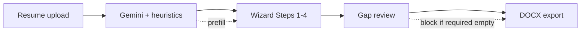

# VMS template coverage — status

**Status:** VMS template expansion **complete** (June 2026). Authoritative tag inventory: [`VMS-FIELD-MANIFEST.md`](./VMS-FIELD-MANIFEST.md). Active backlog: [`TODO.md`](./TODO.md).

Epic [#16](https://github.com/juanroddotdev/resume-rocket/issues/16) · issues [#10–#15](https://github.com/juanroddotdev/resume-rocket/issues/16).

**Historical execution plan (Steps 0–5 build instructions):** [`archive/VMS-FULL-COVERAGE-PLAN-2026-05-EXECUTION.md`](./archive/VMS-FULL-COVERAGE-PLAN-2026-05-EXECUTION.md)

---

## What shipped

- **Template inventory** — `scripts/inventory-template-tags.mjs`; [`VMS-FIELD-MANIFEST.md`](./VMS-FIELD-MANIFEST.md); [`VMS-TEMPLATE-REGISTRY.md`](./VMS-TEMPLATE-REGISTRY.md)
- **JSONB normalization** — [`server/utils/normalizeCandidate.ts`](../server/utils/normalizeCandidate.ts) on parse, PATCH, DOCX (#11)
- **Full wizard** — Steps 0–4 + gap review; specialties, employer detail, education, clinical summary, credentials with expiry
- **Gemini parse (Phase C)** — full manifest field schema in [`server/utils/geminiShared.ts`](../server/utils/geminiShared.ts)
- **docxBuilder** — 37/37 scalar tags + 7/7 loops mapped; smoke: `node scripts/test-docx-mapping.mjs`
- **Hospital linking** — parse suggestions + in-card facility link; beds/trauma/teaching from hospital DB only
- **Parse audit (Phase A)** — server-only `parsed_resume.audit` for QA tuning

---

## Completed steps (Steps 0–5)

| Step | Scope | Status |
| --- | --- | --- |
| 0 | Template inventory + manifest | Done |
| 1 | JSONB normalization (#11) | Done |
| 2 | Schema migration + extended employers/education | Done |
| 3 | Gemini full-field parse (Phase C) | Done |
| 4 | Wizard UI + gap review (Phase B) | Done |
| 5 | docxBuilder full wiring (Phase A) | Done |

Original task lists: [`archive/VMS-FULL-COVERAGE-PLAN-2026-05-EXECUTION.md`](./archive/VMS-FULL-COVERAGE-PLAN-2026-05-EXECUTION.md).

---

## Remaining — Step 6 (hardening)

| Issue | Scope | Status |
| --- | --- | --- |
| [#10](https://github.com/juanroddotdev/resume-rocket/issues/10) | Template inventory verification | **Done** — manifest + inventory script |
| [#11](https://github.com/juanroddotdev/resume-rocket/issues/11) | JSONB normalization | **Done** |
| [#12](https://github.com/juanroddotdev/resume-rocket/issues/12) | Parse outcome visibility | **Done** — [`parseOutcomeLog.ts`](../server/utils/parseOutcomeLog.ts) (#45) |
| [#13](https://github.com/juanroddotdev/resume-rocket/issues/13) | `/api/parse` rate limiting | **Done** — [`parseRateLimit.ts`](../server/utils/parseRateLimit.ts) |
| [#14](https://github.com/juanroddotdev/resume-rocket/issues/14) | CI regression tests | **Partial** — unit + script smokes in CI; expand per [Test automation plan](./TODO.md#test-automation-plan) |
| [#15](https://github.com/juanroddotdev/resume-rocket/issues/15) | Release checklist | **Partial** — [`RELEASE-CHECKLIST.md`](./RELEASE-CHECKLIST.md) exists; sign-off + automation in progress |

Next engineering focus: [Test automation plan](./TODO.md#test-automation-plan) (fixture PDF regression, API integration, optional Playwright E2E).

---

## Definition of done (VMS expansion milestone)

- [x] `scripts/inventory-template-tags.mjs` reports **zero unmapped** contract tags
- [x] Gemini prefill populates extractable fields; wizard + gap review collect the rest
- [x] Gap review blocks submit until required tags are filled
- [ ] Admin + intake DOCX downloads verified for 3 test profiles (parse-heavy, manual-heavy, mixed) — manual sign-off on [`RELEASE-CHECKLIST.md`](./RELEASE-CHECKLIST.md)
- [x] `npm run build` passes; DOCX smoke script passes; CI runs unit + script tests
- [ ] Expanded CI per #14 — see [TODO.md](./TODO.md#test-automation-plan)
- [x] [`MVP-PLAN.md`](./MVP-PLAN.md) frontmatter reflects shipped MVP

---

## Risks to watch

- **Template fragility:** Re-run `node scripts/inventory-template-tags.mjs` after `template.docx` edits (`.cursor/rules/docxtemplater-safety.mdc`).
- **Gemini schema size:** Test prompt changes with `scripts/test-pdf-vision.mjs` and recorded fixtures (TODO test automation Phase 1).
- **PHI:** Do not return full `parsed_resume` to client; strip PII from logs (`.cursor/rules/phi-handling.mdc`).
