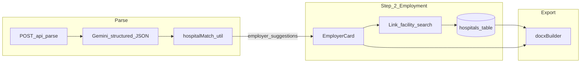

> **Archived** — Work described here is shipped. Active backlog: [TODO.md](../TODO.md). Doc index: [README.md](../README.md).

# Hospital grounding and employer reconciliation

**Status:** Shipped — PRs #37–#38; optional deferrals in [TODO.md](../TODO.md).

**Epic:** Part of [#16](https://github.com/juanroddotdev/resume-rocket/issues/16) (hardening sprint).

**Prerequisite:** Import facility data via [`HOSPITAL-DATA.md`](../HOSPITAL-DATA.md) and [`scripts/seed_hospitals.py`](../scripts/seed_hospitals.py) (`--fetch` for CMS + HIFLD hybrid). PR 2–3 autocomplete and matching are only useful once `hospitals` has real rows beyond the dev seed.

**Related:** [VMS full coverage plan](../VMS-FULL-COVERAGE-PLAN.md), [VMS field manifest](../VMS-FIELD-MANIFEST.md) (employer beds/trauma/teaching = hospital DB, not Gemini).

---

## Goals (from external assessment review)

| Gap today | Target |
|-----------|--------|
| ~15 seeded hospitals; metrics sparse | Load beds/trauma/teaching from a **CSV you download** via import script |
| Parse adds free-text employers; search **adds** duplicates | **Link in place** on each `EmployerCard` |
| No post-parse facility hints | Parse API returns **top hospital matches** per employer (DB only, never Gemini beds) |
| Single RN license in DOCX | Optional Phase 2: `licenses[]` if multi-license resumes are common |

**Out of scope:** Gemini schema renamed to `candidate_first_name` / `professional_experiences`; beds/trauma/teaching from the model.



---

## Implementation checklist

- [x] **PR 1 (data tooling)** — `scripts/seed_hospitals.py` + `docs/HOSPITAL-DATA.md` (hybrid merge); apply migration `20260531000000_hospitals_source_id.sql`
- [ ] **PR 1b** — Hospital search quality (`pg_trgm` tuning) if needed after seed
- [ ] **PR 2** — Server matching + parse response suggestions
- [ ] **PR 3** — Step 2 in-place facility linking (main UX fix)
- [x] **PR 4** — Gemini guidance (small, no schema flattening)
- [ ] **PR 5 (optional)** — Multi-license list

---

## PR 1 — Hospital CSV import and search quality

**Data sourcing:** Download a public hospital export (AHD profile CSV, CMS hospital/general info, etc.) — document sources in `docs/HOSPITAL-DATA.md`; do not commit the raw file.

- Column mapping: `name`, `city`, `state`, `beds`, `trauma_level`, `teaching_status` (script tolerates missing trauma/teaching).
- Runbook: place file at `data/hospitals.csv` (gitignored), run import with service role.

**Import script:** `scripts/import-hospitals.mjs`

- Normalize: trim names, uppercase state, parse numeric beds, map teaching to boolean.
- Upsert into `hospitals` on stable key — migration for `source_id TEXT` or unique `(lower(name), city, state)` to avoid duplicates on re-import.
- `--dry-run` and summary counts (inserted/updated/skipped).

**Search:** `server/api/hospitals/search.get.ts`

- Prefer `pg_trgm` similarity on `name` when appropriate; keep ILIKE fallback.
- Return: `id, name, city, state, beds, trauma_level, teaching_status, score`.

**Dev baseline:** Keep existing seed in migrations for local smoke; production relies on import.

---

## PR 2 — Server matching + parse response suggestions

**New:** `server/utils/hospitalMatch.ts`

```ts
matchHospitals(query: { name: string; city?: string; state?: string }, limit?: number)
  => Array<HospitalRow & { score: number }>
```

- Trigram/name contains + city/state bonus; no Gemini; service-role Supabase only.
- Test: `scripts/test-hospital-match.mjs`

**Parse response:** `server/api/parse.post.ts`, `server/utils/parseResponse.ts`

- Per `suggested_employers[]` without `hospitalId`: `employer_hospital_suggestions` (max 3).
- **Do not** auto-persist beds/trauma/teaching — candidate must confirm.
- `applyParseResult` + optional `hospitalSuggestions` on `EmployerEntry`; strip before PATCH in normalize/autosave.

---

## PR 3 — Step 2 in-place facility linking

**Problem:** `HospitalAutocomplete` appends employers; parsed rows stay unlinked.

**New:** `composables/useHospitalSearch.ts` (debounced search, loading/error/empty).

**`EmployerCard`:**

- Unlinked: inline “Confirm facility” + suggestions from parse.
- On select: patch same row with `hospitalId`, `beds`, `traumaLevel`, `teachingStatus` — no duplicate.
- Linked: show metrics + “Change facility”.

**`HospitalAutocomplete`:** Use composable; reduce duplicate-add confusion.

**Optional:** Soft gap hint in `utils/vmsGapReview.ts` when `!hospitalId` (non-blocking).

---

## PR 4 — Gemini guidance

Expand `GEMINI_VMS_FIELD_GUIDE` in `server/utils/geminiShared.ts` (and text/vision prompts):

- `unit_bed_count` = unit only; never hospital-wide beds.
- No facility beds/trauma/teaching in `suggested_employers`.
- Years of experience, compact license, array splitting guidance.

Verify: `node scripts/test-pdf-vision.mjs`, `node scripts/test-gemini-parse-map.mjs`.

---

## PR 5 (optional) — Multi-license list

Only if resumes often list multiple active licenses:

- `candidates.licenses` JSONB migration
- `licenses[]` in Gemini schema + `docxBuilder` `active_licenses_list`
- Wizard add/remove rows on Step 3

---

## PR sequence

| PR | Concern |
|----|---------|
| 1 | Hospital data + search |
| 2 | Parse API + matcher |
| 3 | Employment UX |
| 4 | Gemini prompts |
| 5 | Multi-license (optional) |

One concern per PR; squash merge; `Part of #16` in PR bodies.

---

## Test plan

**PR 1:** Import dry-run; search finds imported hospital by partial name.

**PR 2–3:** Upload PDF → employers prefilled → suggestions → link facility → `node scripts/test-docx-mapping.mjs` shows beds/trauma; no duplicate employers; manual path still works.

**PR 4:** Parse smoke scripts; no regression on manual continue.

**PR 5:** DOCX with 2+ licenses if implemented.

---

## Pre-ship / ops

- Release checklist: run hospital CSV import on new Supabase projects.
- Import script logs counts only, not row contents at scale (PHI).
