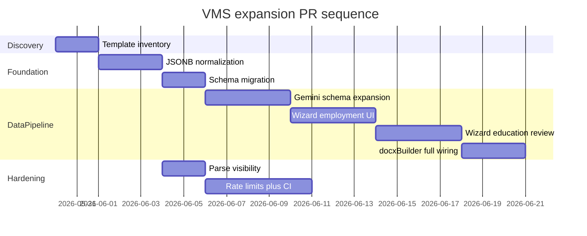

> **Archived** — Work described here is shipped. Active backlog: [TODO.md](../TODO.md). Doc index: [README.md](../README.md). Current status: [VMS-FULL-COVERAGE-PLAN.md](../VMS-FULL-COVERAGE-PLAN.md).

# VMS Full Template Coverage — Next Steps

Related: [`VMS-TEMPLATE-REGISTRY.md`](../VMS-TEMPLATE-REGISTRY.md), [`PROJECT-REVIEW.md`](../PROJECT-REVIEW.md), [`MVP-PLAN.md`](../MVP-PLAN.md), [`HOSPITAL-PARSE-UX-PLAN.md`](./HOSPITAL-PARSE-UX-PLAN.md) (deferred — facility DB import + employer linking). Epic **#16** (hardening sprint); issues **#10–#15**.

**Goal:** Every tag in the contract [`server/assets/template.docx`](../server/assets/template.docx) must be populated — Gemini parse first, wizard manual entry when parse cannot fill it.

---

## Where the project stands today

**Shipped (MVP + Phase A):** Invite-gated intake → parse (text + vision + heuristics) → 4-step wizard → DOCX export → admin hub. Phase A mapping landed in PR #18: [`server/utils/docxBuilder.ts`](../server/utils/docxBuilder.ts) + [`VMS-TEMPLATE-REGISTRY.md`](VMS-TEMPLATE-REGISTRY.md).

**Current gap:** Parse only extracts ~8 field groups ([`server/utils/geminiShared.ts`](../server/utils/geminiShared.ts)); wizard has no UI for specialties, employer role/dates, education, or clinical detail; **13+ template tags** are intentionally blank in the registry.

```mermaid
flowchart TB
  subgraph today [Today]
    Upload[Resume upload]
    Gemini[Gemini parse - partial schema]
    Wizard[Wizard - identity hospitals certs]
    Docx[docxBuilder - many blanks]
  end
  Upload --> Gemini --> Wizard --> Docx

  subgraph target [Target]
    Upload2[Resume upload]
    Gemini2[Gemini parse - full template schema]
    GapReview[Review step - fill missing tags]
    Wizard2[Wizard - all field groups]
    Docx2[docxBuilder - zero intentional blanks]
  end
  Upload2 --> Gemini2 --> Wizard2 --> GapReview --> Docx2
  Gemini2 -.->|prefill| Wizard2
  GapReview -.->|block submit if required tag empty| Docx2
```



---

## Step 0 — Template inventory (do first, small PR)

Because we have the **contract template** locally, we need an authoritative tag list before coding.

**Tasks:**

1. Add `scripts/inventory-template-tags.mjs` — unzip `template.docx`, regex-scan `word/document.xml` (+ headers/footers if present) for `{tag}` and `{#loop}...{/loop}` names.
2. Diff output against [`mapCandidateToTemplateData()`](../server/utils/docxBuilder.ts) and [`VMS-TEMPLATE-REGISTRY.md`](VMS-TEMPLATE-REGISTRY.md).
3. Create **`docs/VMS-FIELD-MANIFEST.md`** — one row per tag:

   | Template tag | DB / JSON path | Parse (Gemini) | Wizard step | Required at submit |

4. Run `node scripts/test-docx-mapping.mjs` + download 3 admin DOCX samples against contract template to confirm layout (not just dev placeholder).

**Done when:** Complete tag inventory committed; any tags in contract but missing from registry are listed.

**Issue:** Part of epic #16; closes any remaining #10 verification checkboxes.

---

## Step 1 — Foundation: JSONB normalization (#11)

Before adding many new fields, stabilize shape on all read/write boundaries ([`PROJECT-REVIEW.md`](PROJECT-REVIEW.md) §7 item 2).

**Tasks:**

1. Add [`server/utils/normalizeCandidate.ts`](../server/utils/normalizeCandidate.ts):
   - `normalizeEmployers()` — canonical camelCase (`traumaLevel`, `teachingStatus`, `startDate`, …)
   - `normalizeCredentials()` — support `{ BLS: true }` today and future `{ BLS: { active, expiry } }`
   - `normalizeEducation()` — new array shape
2. Apply on: `POST /api/parse`, `PATCH /api/candidates/[id]`, `POST /api/generate-docx`.
3. Extend [`server/utils/schemas.ts`](../server/utils/schemas.ts) + [`types/candidate.ts`](../types/candidate.ts) with canonical types (see Step 2 fields).
4. Document canonical shapes in manifest.

**Done when:** Mixed legacy keys → identical DOCX output; new saves always normalized.

**Issue:** Closes #11.

---

## Step 2 — Schema expansion (Phase B data model)

Add storage for all registry-blank tags. Prefer **JSONB for nested arrays** (employer sub-fields, education) and **top-level columns** for high-value scalars recruiters filter on.

| Template tag(s) | Proposed storage |
|-----------------|------------------|
| `total_years_nursing_experience` | `candidates.years_nursing_experience` (TEXT or NUMERIC) |
| `compact_license_status` | `candidates.compact_license_status` (TEXT enum: Yes/No/N/A) |
| `average_patient_ratios`, `specialized_medical_equipment` | `candidates.average_patient_ratios`, `specialized_medical_equipment` (TEXT) |
| `{#education}...` | `candidates.education` JSONB `[{ degree, school, graduationYear }]` |
| `primary_specialty_unit`, `clinical_specialties_list`, `core_clinical_competencies` | existing `specialties TEXT[]` — add wizard UI |
| `experience_*` per employer | extend `employers` JSONB entries (see below) |
| BLS/ACLS/PALS expiration tags | extend `credentials` to `{ key: { active, expiry? } }` with normalization |
| NIHSS/TNCC/CCRN expiration (if in contract) | same credentials shape |

**Extended `EmployerEntry`** ([`types/candidate.ts`](../types/candidate.ts)):

```typescript
employmentType?: string      // experience_employment_type
unitBedCount?: string        // experience_unit_bed_count
patientScope?: string        // experience_patient_scope
floatedUnits?: string[]      // experience_floated_units_list
equipmentProcedures?: string[] // experience_equipment_procedures_list
avgDailyPatients?: string    // experience_average_daily_patients
patientAcuity?: string       // experience_patient_acuity_level
highlights?: string[]        // experience_highlights
// existing: role, startDate, endDate, name, city, state, beds, traumaLevel, teachingStatus
```

**Migration:** New Supabase migration adding scalar columns + defaults; JSONB columns need no DDL change but PATCH schema must accept new keys.

**Issue:** Part of #16; label **Phase B** in PR title.

---

## Step 3 — Gemini parse expansion (Phase C)

Expand [`GeminiResumeJson`](../server/utils/geminiShared.ts) + `resumeJsonSchema()` + prompts in [`geminiParse.ts`](../server/utils/geminiParse.ts) / [`geminiDocumentParse.ts`](../server/utils/geminiDocumentParse.ts) to extract **every manifest field**.

**Tasks:**

1. Mirror manifest fields in JSON schema (nested `education[]`, rich `suggested_employers[]`, scalars, credential expiries).
2. Update `mapGeminiResumeJson()` → [`types/parse.ts`](../types/parse.ts) → `parse.post.ts` persistence → `applyParseResult()` in [`composables/useCandidateForm.ts`](../composables/useCandidateForm.ts).
3. Extend [`parseResponse.ts`](../server/utils/parseResponse.ts) `fields_found` counting for new groups.
4. Keep PHI rules: no full resume text in logs; `parsed_resume` stays server-side blob.

**Done when:** Uploading a rich resume prefills all extractable template tags; partial parse still allows manual completion.

**Issue:** Part of #16; label **Phase C**.

---

## Step 4 — Wizard UI + gap review (Phase B)

Expand intake in **2 PRs** to stay under 15-file limit (`.cursor/rules/pr-size.mdc`).

### PR 4a — Employment & specialties (Step 2)

[`pages/intake/[token].vue`](../pages/intake/[token].vue) + [`HospitalAutocomplete.vue`](../components/intake/HospitalAutocomplete.vue):

- **Specialties:** chip input (prefilled from parse; editable)
- **Per-employer card:** role, start/end dates, employment type
- Optional collapse: unit beds, patient scope, acuity, avg daily patients, floated units, equipment/procedures, highlights (textarea or tag input)

### PR 4b — Credentials, education, experience summary (Step 3 + review)

- [`CredentialsChecklist.vue`](../components/intake/CredentialsChecklist.vue): optional expiry date per cert (when checked)
- **New section or Step 3.5:** years of experience, compact license, patient ratios, specialized equipment
- **Education repeater:** degree / school / graduation year (add/remove rows)
- **Gap review gate** before "Download VMS-Ready Resume":
  - `computeMissingTemplateFields(form)` based on manifest
  - Inline inputs for any required tag still empty
  - Block submit with clear message + recovery (edit fields above)
  - Loading / error / empty states per empty-error-states rule

Autosave via existing `scheduleAutosave` PATCH path; extend [`candidatePatchSchema`](../server/utils/schemas.ts).

---

## Step 5 — DOCX wiring (Phase A completion)

Update [`mapCandidateToTemplateData()`](../server/utils/docxBuilder.ts) to map **every manifest tag** — remove hardcoded `''` / `[]` placeholders.

**Tasks:**

1. Map new candidate scalars + `education[]` loop
2. Map extended employer fields into `{#professional_experiences}` sub-tags and nested loops
3. Map credential expiries (real dates when collected, else empty — not fake `"Current"`)
4. Update [`VMS-TEMPLATE-REGISTRY.md`](VMS-TEMPLATE-REGISTRY.md) — move tags from "blank" to "mapped"
5. Extend [`scripts/test-docx-mapping.mjs`](../scripts/test-docx-mapping.mjs) fixture to assert all tags non-empty for sample candidate

**Done when:** Contract template DOCX has no blank tags for a fully completed wizard submission.

---

## Step 6 — Hardening sprint (parallel track)

Run alongside Steps 1–5 where it does not block feature work:

| Issue | Why now | Key files |
|-------|---------|-----------|
| **#12** Parse visibility | More parse fields = more failure modes to classify | [`parse.post.ts`](../server/api/parse.post.ts) |
| **#13** Rate limiting | Protect expanded Gemini schema (larger prompts) | [`parse.post.ts`](../server/api/parse.post.ts), [`FileDropZone.vue`](../components/intake/FileDropZone.vue) |
| **#14** CI regression tests | Lock parse contract + DOCX smoke as schema grows | new `tests/` + GitHub workflow |
| **#15** Release checklist | Consolidate manual test plan before shipping VMS expansion | `docs/RELEASE-CHECKLIST.md` |

Recommended order after Step 1: **#12 → #13 → #14 → #15**.

---

## Suggested PR sequence (one concern per PR)



| PR | Scope | Closes |
|----|-------|--------|
| 1 | Template tag inventory + manifest doc | #10 verification |
| 2 | JSONB normalization utilities | #11 |
| 3 | DB migration + types + PATCH schema | Phase B schema |
| 4 | Gemini full-field parse (Phase C) | — |
| 5 | Wizard Step 2: specialties + employer detail | Phase B |
| 6 | Wizard Step 3+: education, scalars, gap review | Phase B |
| 7 | docxBuilder maps all manifest tags | Phase A complete |
| 8 | Parse logging (#12) | #12 |
| 9 | Rate limit + CI + release checklist (#13–#15) | #13–#15 |

---

## Definition of done (VMS expansion milestone)

- [ ] `scripts/inventory-template-tags.mjs` reports **zero unmapped** contract tags
- [ ] Gemini prefill populates all extractable fields; wizard collects the rest
- [ ] Gap review blocks submit until required tags are filled
- [ ] Admin + intake DOCX downloads show populated contract sections for 3 test profiles (parse-heavy, manual-heavy, mixed)
- [ ] `npm run build` passes; DOCX smoke script passes; CI covers parse contract + export
- [ ] [`MVP-PLAN.md`](MVP-PLAN.md) frontmatter todos updated to reflect shipped state (stale today)

---

## Risks to watch

- **Template fragility:** Contract edits in Word can split tags across XML runs — re-inventory after template changes (`.cursor/rules/docxtemplater-safety.mdc`).
- **Wizard length:** Many new fields → use collapsible employer cards + dedicated review step to avoid 10-step wizard fatigue.
- **Gemini schema size:** Very large JSON schemas may hit model limits — group optional employer clinical fields as optional nested object; test with `scripts/test-pdf-vision.mjs`.
- **PHI:** Do not return full `parsed_resume` to client; strip PII from new structured logs.

---

## Immediate next action

Start **PR 1: template inventory** — run tag extraction against the contract `template.docx`, produce `docs/VMS-FIELD-MANIFEST.md`, and reconcile with the registry before any schema or UI work.
